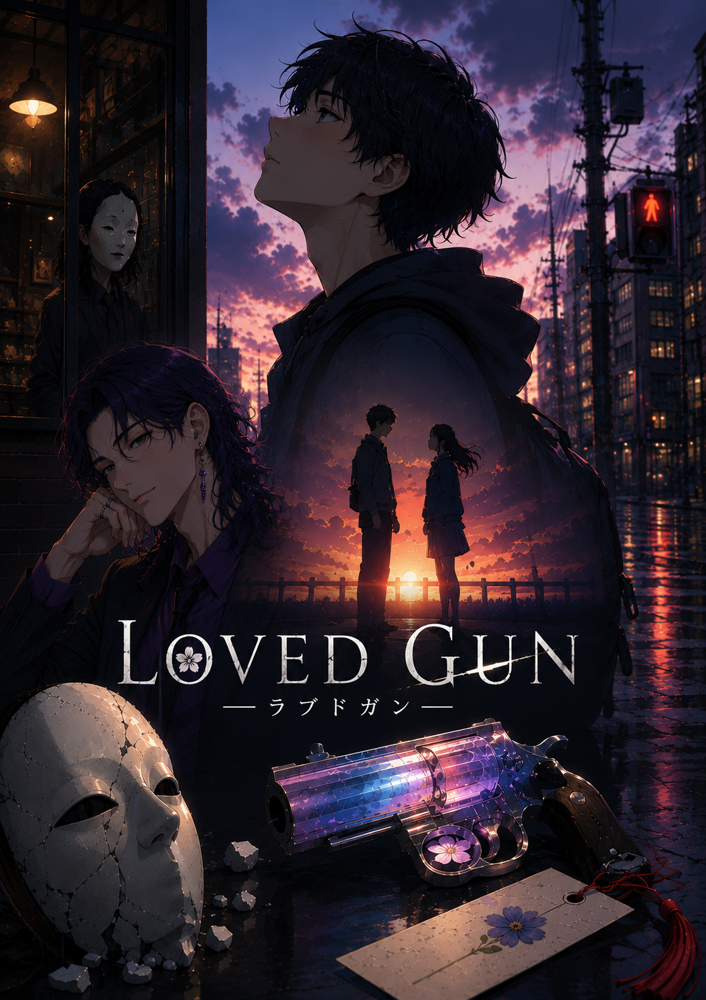

# LOVED GUN / ラブドガン



自作小説『ラブドガン』を原作とする、短編アニメーション映画およびシリーズ企画の制作リポジトリです。

> 忘れたいのは、君じゃなかった。

## 作品概要

失恋の痛みに耐えられなくなった高校生・春川陽は、感情を預けられるという奇妙な店「感情銀行」を訪れる。

頭取を名乗る時守クラとの契約によって苦しみから解放された陽だったが、日常には誰かが存在した痕跡だけが残されていた。雨の匂い、空席、ミントの香り、名前のないしおり。

やがて陽は、黒いスーツと白い小面を身につけた謎の人物に見つめられていることに気づく。

## 形式

### Short Film

- 約20分の短編アニメーション映画
- 制作予算想定：1,000万円
- 映画祭出品、企画提案、シリーズ展開のためのパイロット作品

### Series Project

- TVアニメ全12話構想
- 感情銀行、ラブドガン、ノウメンの世界を拡張

## テーマ

- 喪失を受け入れる勇気
- 忘れることと前へ進むことの違い
- 感情は弱さか、存在した時間の証明か
- 愛は記憶より長く残るのか

## 主要モチーフ

- 雨：言葉にできない感情
- しおり：忘れたくない時間
- ミント：残された気配
- 能面：封じられた感情
- 信号：選択と人生の分岐
- 鈴：現実と感情領域の境界

## ディレクトリ

```text
Loved-Gun/
├── project/
├── world-bible/
├── characters/
├── screenplay/
├── series/
├── storyboard/
├── concept-art/
├── pitch/
├── budget/
└── festival/
```

## 開発ロードマップ

1. Short Film Bible
2. Treatment
3. 20分版脚本
4. 絵コンテ・カットリスト
5. キャラクター／美術設定
6. 1,000万円版予算・制作スケジュール
7. ピッチデック
8. 映画祭応募パッケージ

## 公開方針

このリポジトリには公開可能な企画資料のみを保存します。物語の核心、未公開原作、制作上の秘密設定はPrivateリポジトリまたはローカル環境で管理します。

## Rights

© Loved Gun Project. All rights reserved.